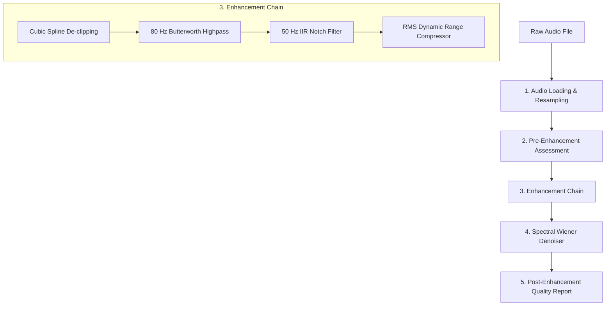

# SVAR Audio Processing & Enhancement Pipeline Guide

This document describes how the SVAR (Sentiment and Voice Analytics for Real-time QA) denoising and enhancement pipeline works, what each step means, and how to run it step-by-step.

---

## Pipeline Overview

The pipeline processes raw, noisy telephone or audio recordings through sequential signal processing stages to output clean, normalized, and denoised audio.



---

## Detailed Step Explanations

### Step 1: Audio Loading & Resampling (`audio_loader.py`)
*   **What it does:** Reads raw audio files (`.mp3`, `.wav`, `.opus`) using `soundfile` and `librosa`.
*   **Why it's needed:** Voice analysis requires a uniform sampling rate. This module downmixes stereo to mono and resamples everything to **16 kHz** to standardize downstream processing.

### Step 2: Quality Assessment (`snr_calculator.py`, `clipping_detector.py`, `silence_ratio.py`)
*   **SNR Calculation:** Measures the Signal-to-Noise Ratio (in dB). Instead of simple FFT, it uses a hybrid approach with Voice Activity Detection (VAD) to isolate speech and noise regions. Higher is better (e.g., >30 dB is very clean).
*   **Clipping Detection:** Computes the percentage of audio samples hitting the digital ceiling ($\geq 99\%$ amplitude). High clipping causes harsh distortion.
*   **Silence Ratio:** Uses RMS-energy threshold VAD to calculate what fraction of the call contains silence vs active speaking.

### Step 3: Audio Enhancement Chain (`enhancement_pipeline.py`)
A sequence of time-domain processors applied to clean the signal:
1.  **Cubic Spline De-clipping (`declipper.py`):** Reconstructs distorted, clipped peaks by fitting cubic splines over surrounding unclipped samples.
2.  **High-Pass Filtering (`highpass_filter.py`):** Cuts off frequencies below **80 Hz** using a 5th-order Butterworth filter. This eliminates sub-bass noises like wind, table thumps, or microphone handling rumble.
3.  **Notch Filtering (`notch_filter.py`):** Attenuates a narrow band around **50 Hz** to eliminate AC electrical power line hum (common in Indian grid systems).
4.  **Dynamic Range Compression (`compressor.py`):** Standardizes vocal volume by compressing loud peaks and boosting quiet speech using RMS-energy envelope tracking.

### Step 4: Spectral Wiener Denoiser (`spectral_denoiser.py`)
*   **What it does:** Subtracts stationary noise (like fan noise, static hiss, or ambient hums) in the frequency domain.
*   **How it works:** 
    *   Frames the audio using a **25ms Short-Time Fourier Transform (STFT)**.
    *   Estimates the noise Power Spectral Density (PSD) from the first **0.5 seconds** of silence.
    *   Applies a Wiener filter gain matrix to attenuate noise bins while leaving speech frequencies intact, utilizing a **spectral floor** to eliminate artificial "musical noise" bubbling.

### Step 5: Verification & Reporting (`tests/test.py`, `visualize_enhancement.py`)
*   Generates a before-and-after frequency spectrum (FFT) plot and time waveform to visually confirm noise reduction.
*   Saves final SNR and clipping metrics in `quality_report.json`.

---

## Step-by-Step Execution Guide

All commands must be executed from the repository root using the virtual environment python interpreter (`venv/bin/python`).

### 1. Set Up Environment
Ensure dependencies are installed and the python path points to the root of the workspace:
```bash
source venv/bin/activate
```

### 2. View Initial Quality Metrics & Timelines
To run a batch quality report over the raw calls and generate the initial speech-silence timelines:
```bash
python -m denoising.tests.test
```
*   **Inputs read from:** `data/sample_calls/*.mp3`, `*.opus`, `*.wav`
*   **Outputs generated:**
    *   `quality_report.json` (summarizes SNR, clipping ratio, and silence ratio per file).
    *   `data/sample_calls/timeline_<filename>.png` (shows the VAD timeline highlighting speech zones).

### 3. Run and Visualize the Enhancement Pipeline
To run the filter, compression, and peak restoration pipeline on a sample audio file and generate visual plots:
```bash
python -m denoising.visualize_enhancement
```
*   **Inputs read from:** The first audio file in `data/sample_calls/`.
*   **Outputs generated:**
    *   `data/sample_calls/enhancement_comparison_<filename>.png` (shows time-domain and frequency-domain plots comparing raw vs enhanced audio).

### 4. Run the Spectral Wiener Denoiser
To test the Wiener denoiser alone on real audio:
```bash
python -m denoising.spectral_denoiser
```
*   Performs STFT Wiener filtering on the default sample call and prints out original and denoised shapes.

### 5. Run the Integrated Denoiser Pipeline & Benchmark
To run the full integrated pipeline on all raw audio files, generate enhanced WAV outputs, and export a consolidated benchmark CSV report:
```bash
PYTHONPATH=. venv/bin/python denoising/tests/benchmark.py
```
*   **Inputs read from:** `data/sample_calls/` (skips any `_denoised` files).
*   **Outputs generated:**
    *   `data/sample_calls/<filename>_denoised.wav` (fully enhanced and denoised audio).
    *   `data/sample_calls/benchmark_results.csv` (CSV summarizing metrics including SNR before/after, improvement delta, clipping, silence, AC hum removal status, and PASS/FAIL grade).

### 6. Run the MFCC Feature Extractor Tests
To run the validation and shape tests for the custom Mel-Frequency Cepstral Coefficients (MFCC) feature extractor:
```bash
PYTHONPATH=. venv/bin/python diarization/tests/test_mfcc.py
```
*   This verifies that the custom MFCC extraction output matches `librosa`'s MFCC output within a tight numerical tolerance.

### 7. Run All Automated Unit Tests
To run the full suite of synthetic unit tests verifying all signal-level components (notch, HPF, compressor, declipper, silence ratio, VAD, Wiener denoiser):
```bash
python -m unittest discover -s denoising/tests -p "test_synthetic.py"
```
